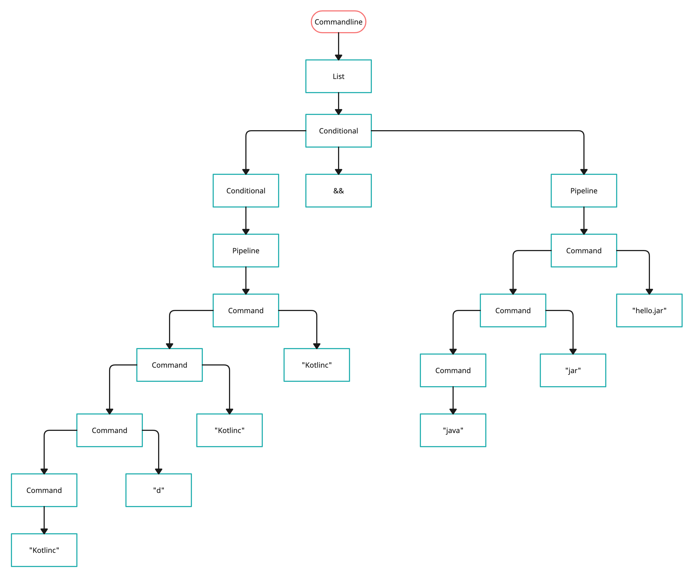
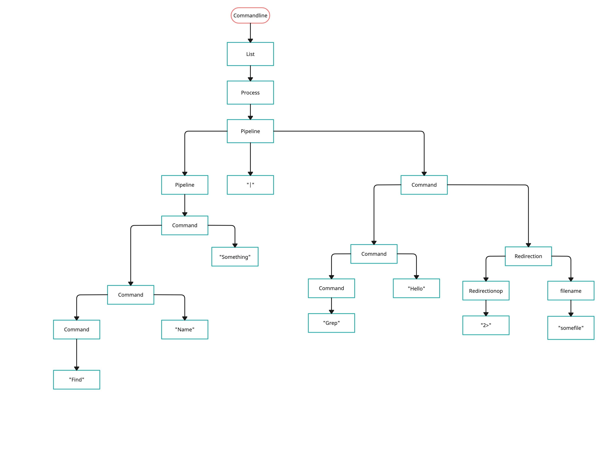

<!-- Assignement 6: 
Gavin Hammersley
CSCI 320 -->


<!-- Syntax Processing -->
```bnf
(1) commandline ::= list
        | list ";"
        | list "&"
(2) list ::= conditional
        | list ";" conditional
        | list "&" conditional
(3) conditional ::= pipeline
        | conditional "&&" pipeline
        | conditional "||" pipeline
(4) pipeline ::= command
        | pipeline "|" command
(5) command ::= word
        | redirection
        | command word
        | command redirection
(6) redirection ::= redirectionop filename
(7) redirectionop ::= "<" | ">" | "2>"

```

<!-- BNF Tables -->
(1) kotlinc d hello.jar hello.kt && java jar hello.jar

| Production | Derivation |
|---|------|
| 1 | commandline => |
| 1 | list => |
| 2 | conditional => |
| 3 | conditional && pipeline => |
| 3 | pipeline && pipeline => |
| 4 | command && pipeline => |
| 5 | command "hello.kt" && pipeline => |
| 5 | command "hello.jar" "hello.kt" && pipeline => |
| 5 | command "d" "hello.jar" "hello.kt" && pipeline => |
| 5 | "kotlinec" "d" "hello.jar" "hello.kt" && pipeline => |
| 4 | "kotlinec" "d" "hello.jar" "hello.kt" && command => |
| 5 | "kotlinec" "d" "hello.jar" "hello.kt" && command "hello.jar" => |
| 5 | "kotlinec" "d" "hello.jar" "hello.kt" && command "jar" "hello.jar" => |
| 5 |  "kotlinec" "d" "hello.jar" "hello.kt" && java "jar" "hello.jar" => |
| 5 |  kotlinc d hello.jar hello.kt && java jar hello.jar |


(2) find name something | grep hello 2> somefile

| Production | Derivation |
|---|------|
| 1 | commandline => |
| 1 | list => |
| 2 | conditional => |
| 3 | pipeline => |
| 4 | pipeline | command => |
| 4 | commmand | command => |
| 5 | command "something" | command => |
| 5 | command "name" "something" | command => |
| 5 | "find" "name" "something" | command => |
| 5 | "find" "name" "something" | command redircetion => |
| 5 | "find" "name" "something" | command "hello" redircetion => |
| 5 | "find" "name" "something" | "grep" "hello" redircetion => |
| 6 | "find" "name" "something" | "grep" "hello" "2>" redirectionop filename => |
| 7 | "find" "name" "something" | "grep" "hello" "2>" filename => |
| 6 | "find" "name" "something" | "grep" "hello" "2>" "somefile" => |
| 6 | find name something | grep hello 2> somefile |


<!-- Image Referencing -->




<!-- Running the Assignment 6 KT code -->
First: 
        kotlinc -d Assignment6_GavinH.jar -include-runtime Assignment6_GavinH.kt
Second:
        java -jar Assignment6_GavinH.jar SampleFile_A6.txt

To exit the program press ctrl-d