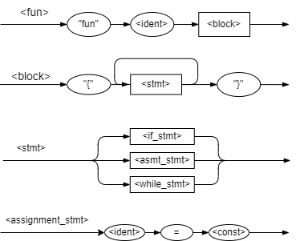

<!-- Assignement 7: 
Gavin Hammersley
CSCI 320 -->

<!--
This kotlin program takes in a list of words, stores them into a list where each words is its own element and used the map{} function to process the list. The average word lenght and standard deviation of the words is printed. 
-->

<!-- Running the Assignment 6 KT code -->
First: 
        kotlinc -d Assignment7_GavinH.jar -include-runtime Assignment7_GavinH.kt
Second:
        java -jar Assignment7_GavinH.jar <your string of words here>

<!-- Derivation -->
Production -> Derivation
-- -- -- -- -- -- -- -- 
<fun> -> "fun"<SomeFunNow>
<block> -> "{" <stmt> { <stmt> } { <stmt> } { <stmt> } "}"
<stmt> -> "{" <asmt_stmt> { <while_stmt> } { <asmt_stmt> } { <if_stmt> } "}"
<asmt_stmt> -> <idx> "=" <5>
<while_stmt> -> "while" "(" <idx> <relop> <0> ")" <block>
<replo> -> ">="
<block> -> "{" <stmt>{ <stmt> } "}"
<stmt> -> <print(idx)> <asmt_stmt>
<asmt_stmt> -> <idx> "=" <idx - 1>
<asmt_stmt> -> <frodo> "=" <"Kotlin Rules">
<if_stmt> -> "if" "(" <frodo> <relop> <"Rules"> ")" <block> ["else" <block>]
<relop> -> "=="
<block> -> "{" <stmt> "}"
<stmt> -> <print("Yes")>
<block> -> "{" <stmt> "}"
<smtm> -> <print("No")>

"fun" <SomeFunNow>
"{" <idx> "=" <5>
{ "while" "(" <idx> ">=" <0> ")" "{" <print(idx>)> <idx> "=" <idx - 1> "}" } 
{ <frodo> "=" <"Kotlin rules"> } 
{ if" "(" <frodo> "==" <"rules"> ")" "{" <print("Yes") "}" "{" ["else" <print("No")> "}"] }
"}"

<!-- Image Referencing -->

